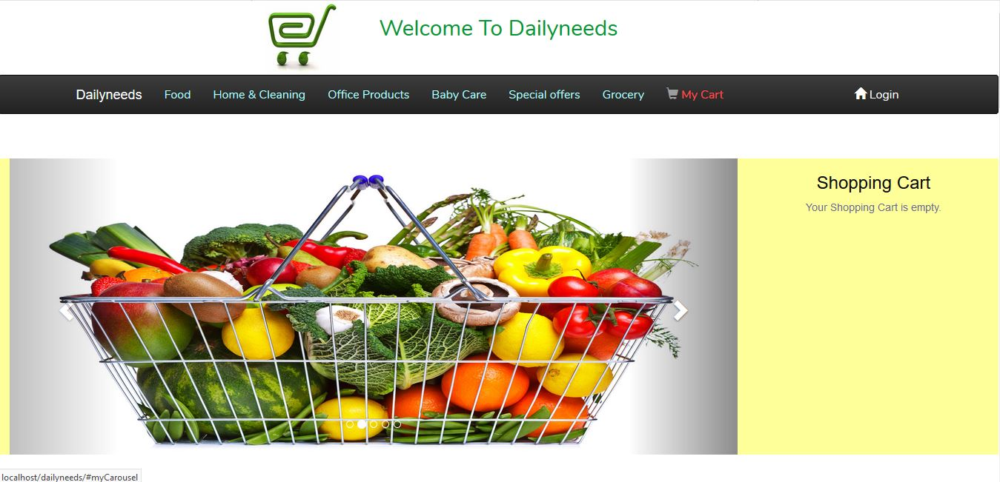
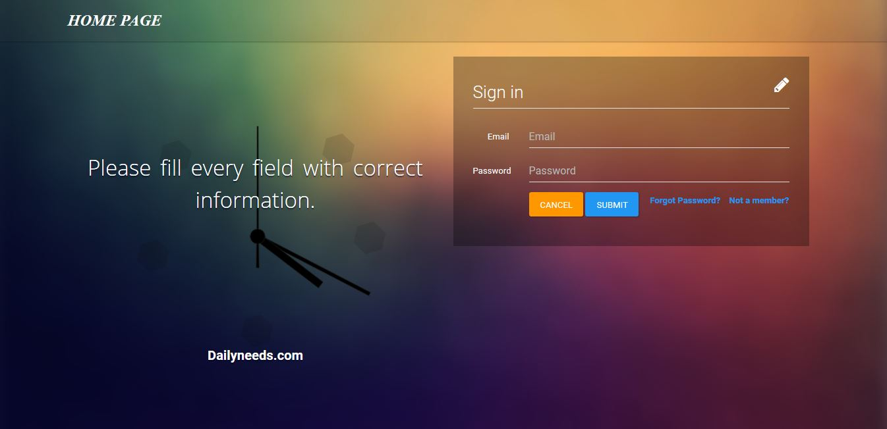
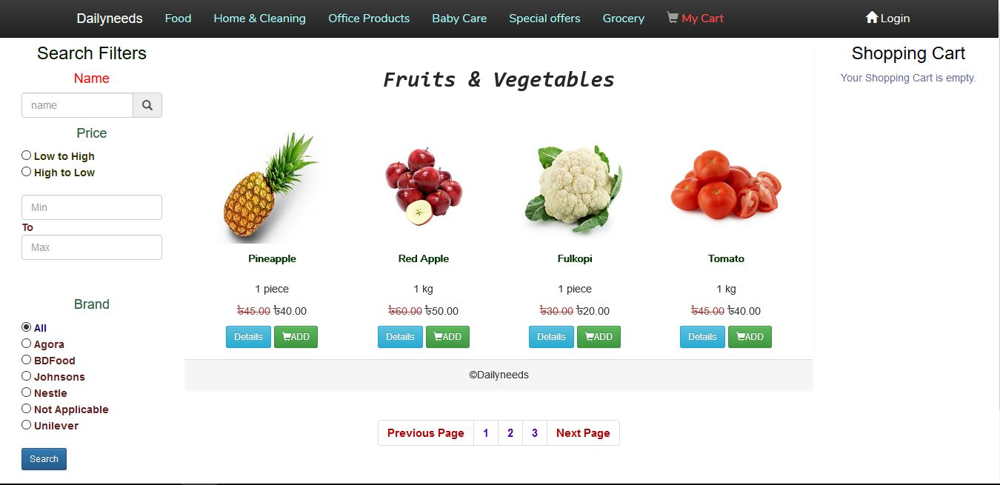
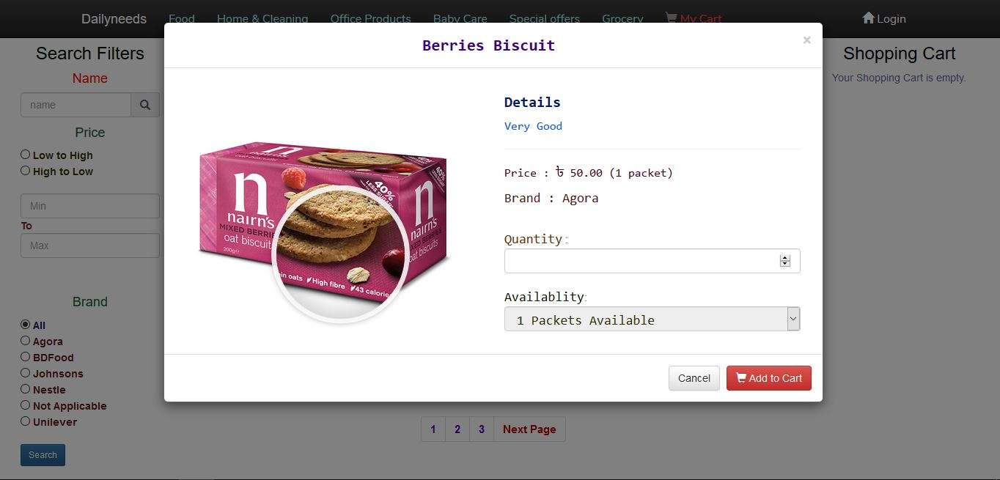
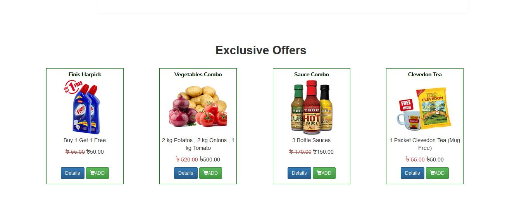

<h1 align="center">Dailyneeds - An Ecommerce Website</h1>

## Description 

This website has detailed information about different categorized products . People can see the products name as well as their descriptive information. Every user has to be registered to buy products . Customers will get cart system in this website so that they can select multiple products at a time and can order them. This website has an improved product search bar to search product by inserting them or by selecting them as category . Customers can search products by giving a price range . Customer can also give feedback about our products . Customers can see their shopping history in their profile . This website maintains a very good user interface . This website has ajax search bar . This website also has imgae magnifier feature . 

 

## How To Run This Project

<b> Step - 1 :- </b> Download or clone this project from this repository . 

<b> Step - 2 :- </b> Create a database named needy in your phpmyadmin and then in that database import a file named needy.sql which is provided here inside the Database folder at the top. 

<b> Step - 3 :- </b> Now go to this path C:\xampp\htdocs and copy that downloaded or cloned project here .  

<b> Step - 4 :- </b> Your downloaded project name should be Dailyneeds-Ecommerce-Master . Now please rename that folder name and give it a name which is Dailyneeds . 

<b> Step - 5 :- </b> Now go to your browser and insert this link http://localhost/dailyneeds/ . Hopefully you will be able to see the index page . 

<b> Step - 6 :- </b> Now you can search products , add the products to the cart , buy products . 

<b> Step - 7 :- </b> While Checking Out Give below informations on your card details:-  
                   1.Name on Card :- You can give any name . 
                   2.Card Number :- 4242 4242 4242 4242   
                   3.CVC :- 123  
                   4.Expire Month and Expire Year :- Choose any month and year which is greater than current month and year .

 

<h2 align="center">Project Screenshots</h2>
 

  
  

  
  

  
  

  
